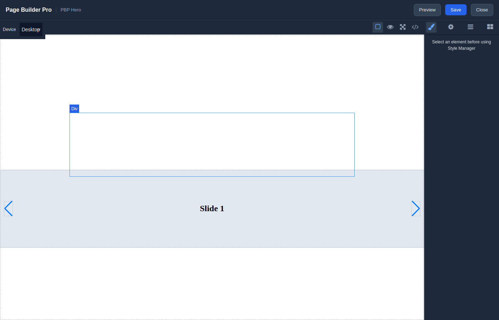
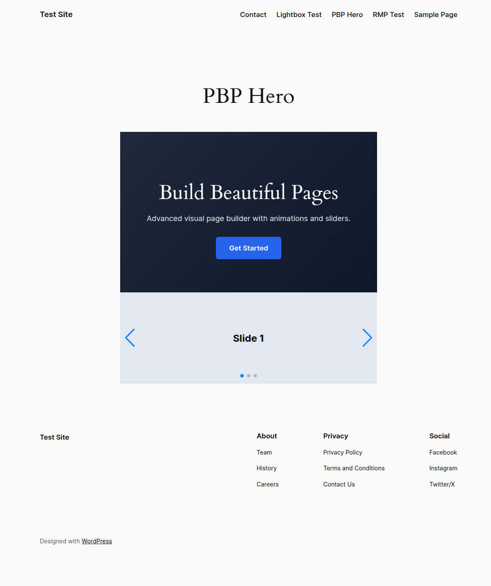
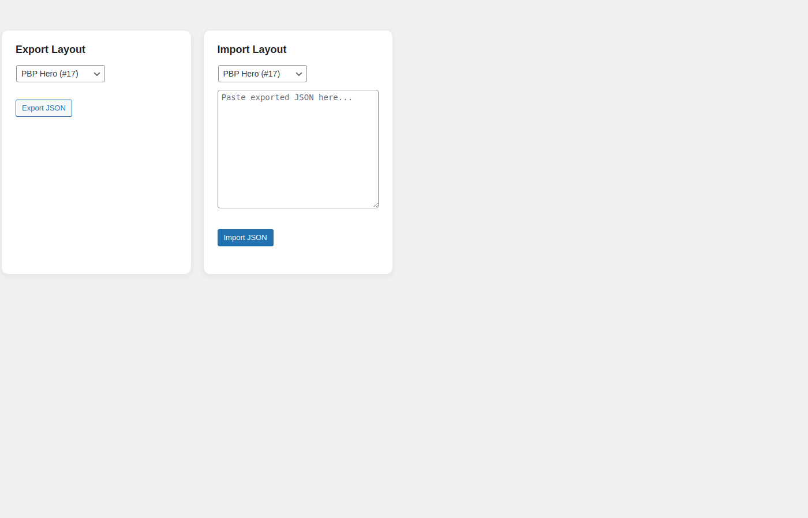

# Page Builder Pro

Advanced drag-and-drop page builder for WordPress powered by [GrapesJS](https://grapesjs.com/).

## Features

- Visual drag-and-drop editor with sections, rows, columns and widgets
- Built-in blocks: Heading, Text, Image, Button, Spacer, Divider, Video, Map, **Carousel**, Shortcode
- Layer / component navigator
- Visual Style Manager (Typography, Layout, Decorations)
- Responsive device preview: Desktop, Tablet, Mobile
- **WordPress Media Library** integration for images
- **AOS scroll animations** for any element
- **Swiper carousel/slider** block
- **Template Export/Import** as JSON
- **Global styles**: colors, body and heading fonts
- One-click Save and live Preview
- Clean frontend output with per-page generated CSS
- Role-based access control

## Usage

1. Install and activate **Page Builder Pro**.
2. Go to `Pages > All Pages` and click **Edit with PBP**.
3. Drag blocks, edit content, style elements, set animations and switch device views.
4. Click **Save** then **Preview**.

## Screenshots

### Dashboard

### Visual builder with animations

### Frontend output with carousel

### Templates export/import

### Settings

## License

GPL-2.0-or-later
