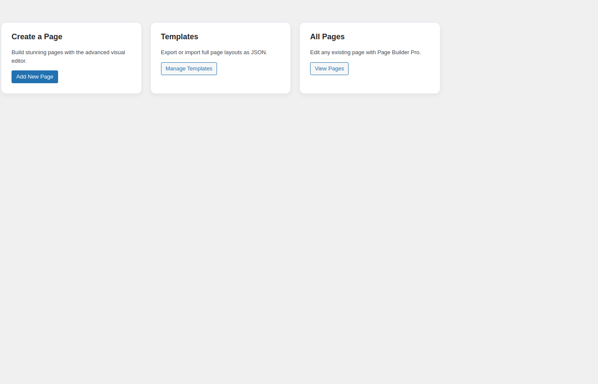
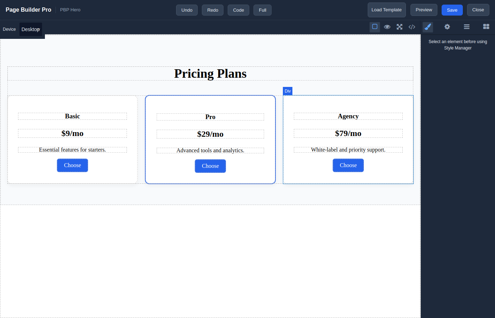
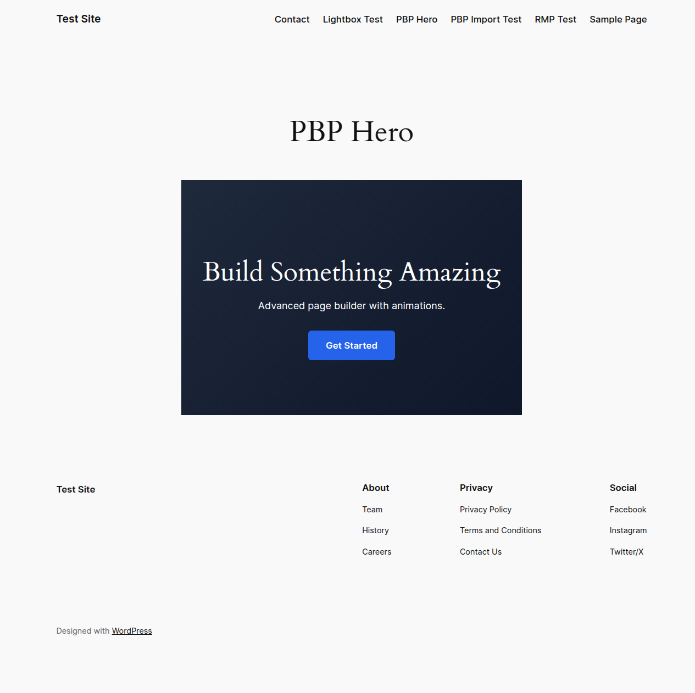
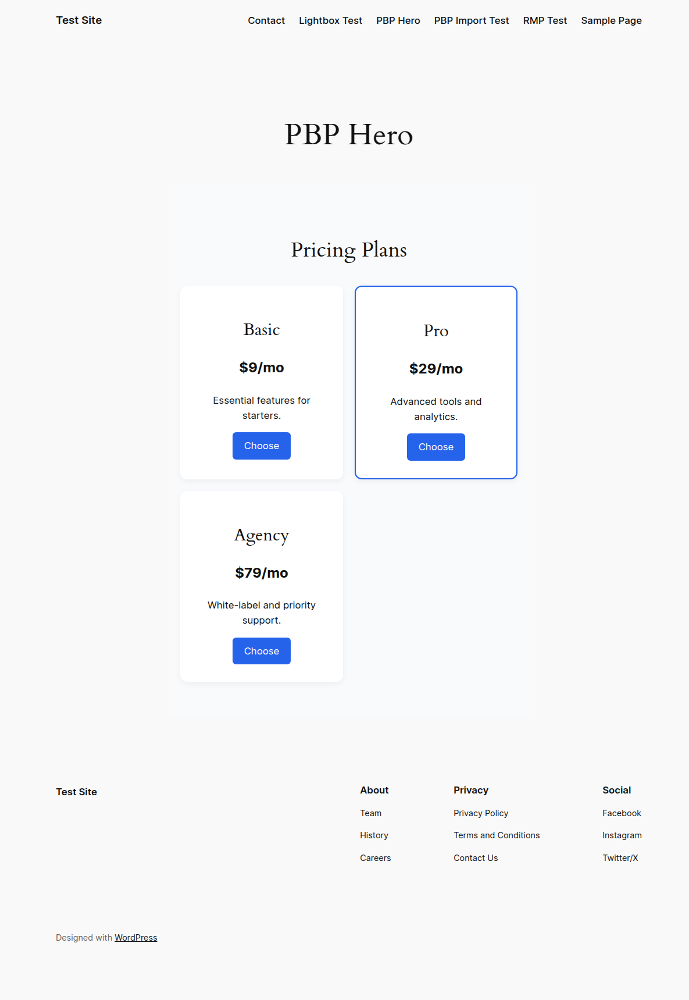
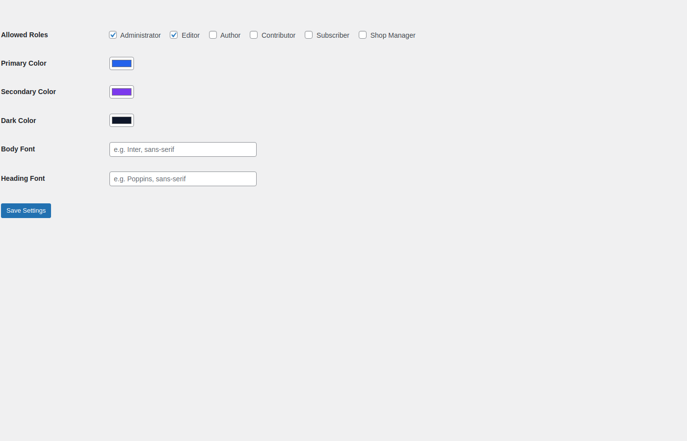

# Page Builder Pro

Advanced drag-and-drop page builder for WordPress powered by [GrapesJS](https://grapesjs.com/) with premium blocks, forms, dynamic content and high-end animations.

## Features

- Visual drag-and-drop editor with sections, rows, columns and widgets
- Premium blocks: Hero, Feature Box, Pricing Table, Testimonial, Counter, Progress Bar, Team Member, FAQ, Call-to-Action, Newsletter, Cookie Banner
- Basic blocks: Heading, Text, Image, Button, Spacer, Divider, SVG Icon
- Media blocks: Video Embed, Map, Swiper Carousel, Lottie Animation
- Interactive blocks: Tabs, Accordion, Countdown, Contact Form, Search Form, Star Rating
- Dynamic blocks: Post Title, Post Excerpt, Featured Image
- Layer / component navigator
- Visual Style Manager (Typography, Layout, Decorations)
- Responsive device preview: Desktop, Tablet, Mobile
- WordPress Media Library integration for images
- AOS scroll animations and GSAP + ScrollTrigger high-end animations
- Top toolbar with Undo, Redo, Code view and Fullscreen
- Built-in template library with pre-made layouts
- Device visibility control (hide on desktop/tablet/mobile)
- Template Export/Import as JSON
- Global styles: colors, body and heading fonts
- One-click Save and live Preview
- Clean frontend output with per-page generated CSS
- Form submissions with email notifications
- Role-based access control

## Usage

1. Install and activate **Page Builder Pro**.
2. Go to `Pages > All Pages` and click **Edit with PBP**.
3. Drag blocks, edit content, style elements, set animations and switch device views.
4. Click **Save** then **Preview**.

## Screenshots

### Dashboard

### Visual builder with template library

### Frontend output with GSAP animations

### Frontend output with pricing table

### Settings

## License

GPL-2.0-or-later
